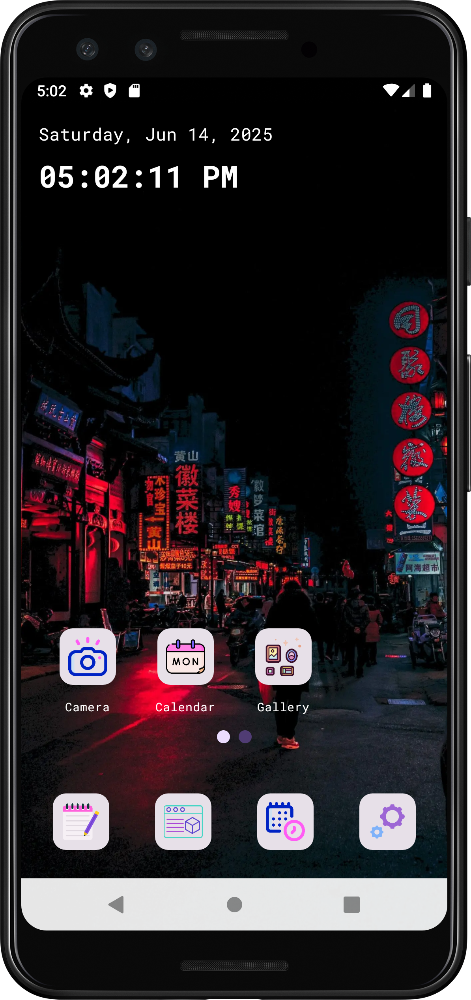
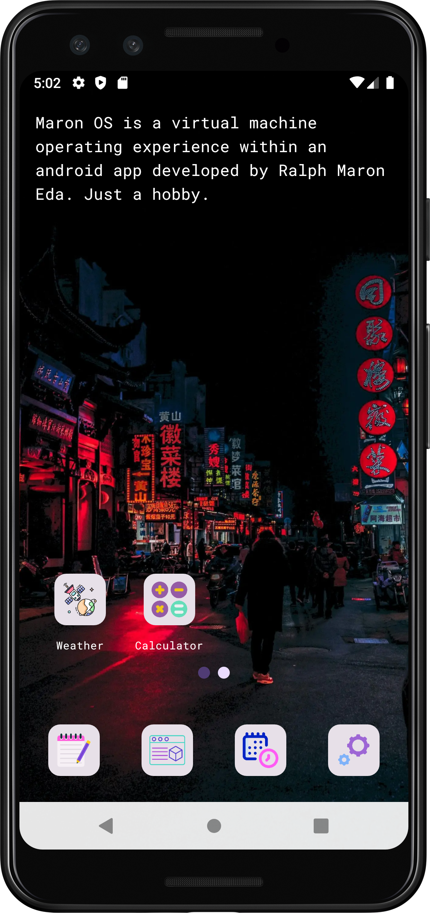

# 📱 MaronOS

**MaronOS** is a modular Android OS-like experience built using **Jetpack Compose Material 3**,
following **clean architecture** and powered by **Koin** for dependency injection. It simulates a
customizable mobile environment with built-in apps like Notes, Music Player, Gallery, Clock, Camera,
and more—all organized in a scalable, feature-based architecture.


---

## 🔗 Repository

GitHub: [https://github.com/ralphmarondev/MaronOS](https://github.com/ralphmarondev/MaronOS)

---

Great! Since your image files are named `first_page.png` and `second_page.png`, here’s the updated
section you can copy-paste into your `README.md`:

---

## 📸 Screenshots

Here’s a sneak peek of **MaronOS** in action:

<div align="center">
  
  
</div>

> 📌 *Responsive across all screen sizes—optimized for mobile experience.*

---

## ✨ Features

* 🎨 Themed UI with dark/light mode
* 🧩 Modular, scalable architecture
* 🔐 Username & password authentication (just like a real OS)
* 📝 Notes app with full CRUD functionality
* 🎶 Music player that reads local files
* 📷 Camera app using CameraX
* 🖼️ Gallery viewer for photos
* ⏰ Clock with alarms and timers
* 🔔 Scheduled notifications
* ⚙️ Settings screen for system preferences

---

## 🛠️ Getting Started

### 1. Clone the Repository

```bash
git clone https://github.com/ralphmarondev/MaronOS.git
cd MaronOS
```

### 2. Open in Android Studio

* Open the root project folder
* Wait for Gradle to sync
* Run the app on your connected Android device or emulator

---

## 📄 License

This project is licensed under the **MIT License**.
See the [LICENSE](LICENSE.txt) file for full details.

---

## 👤 Author

**Ralph Maron Eda**
GitHub: [@ralphmarondev](https://github.com/ralphmarondev)

---

## 🤝 Contributing

Suggestions and contributions are welcome!
Feel free to fork the project, submit issues, or open a pull request.
Let’s build the dream OS together. 🌙✨

